# ino ビルドガイド

## 作り始める前に

いきなりこのページを見ながら作りだすのではなく、一通り目を通したあとで組立てを始めることをおすすめします。

作業を始める前に、 [キットに含まれているもの](./index.md#キットに含まれているもの) に不足がないことを確認してください。不足がある場合、発送日から2週間以内に連絡いただければ無料発送致します。

組立てに使う工具については [キット以外に必要なもの](./index.md/#キット以外に必要なもの) をご確認ください。

## マウスボタンスイッチのはんだ付け

左/右基板のおもて面にマウスボタン用のマイクロスイッチ（合計3つ）をハンダ付けします。

マイクロスイッチの向きは、写真のように青色の部分が基板の端に近くなるようにします。

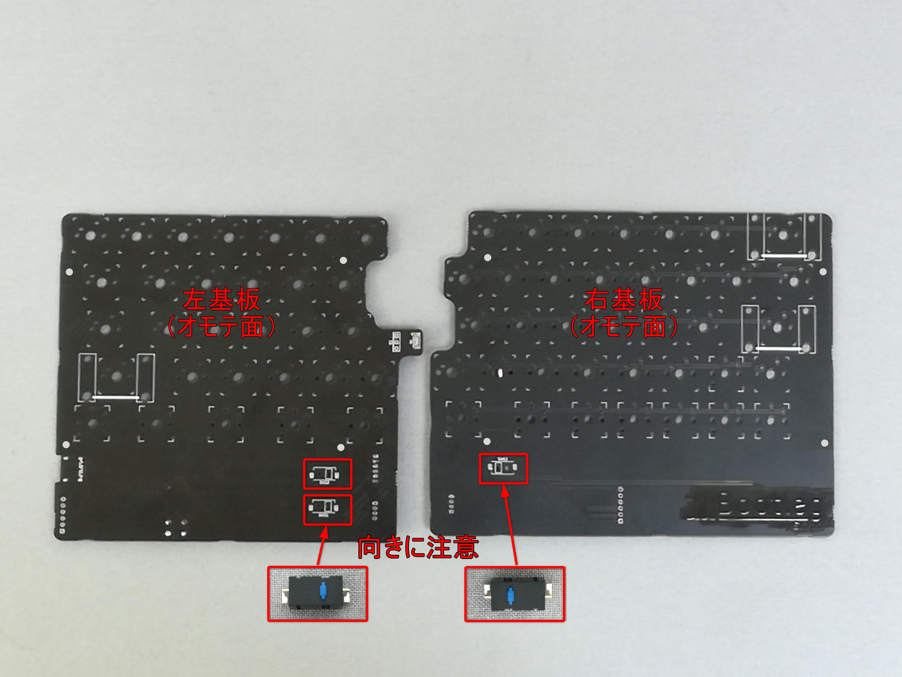

## 動作確認

組み立てる前に、ケーブルをつないで動作確認をしておきます。

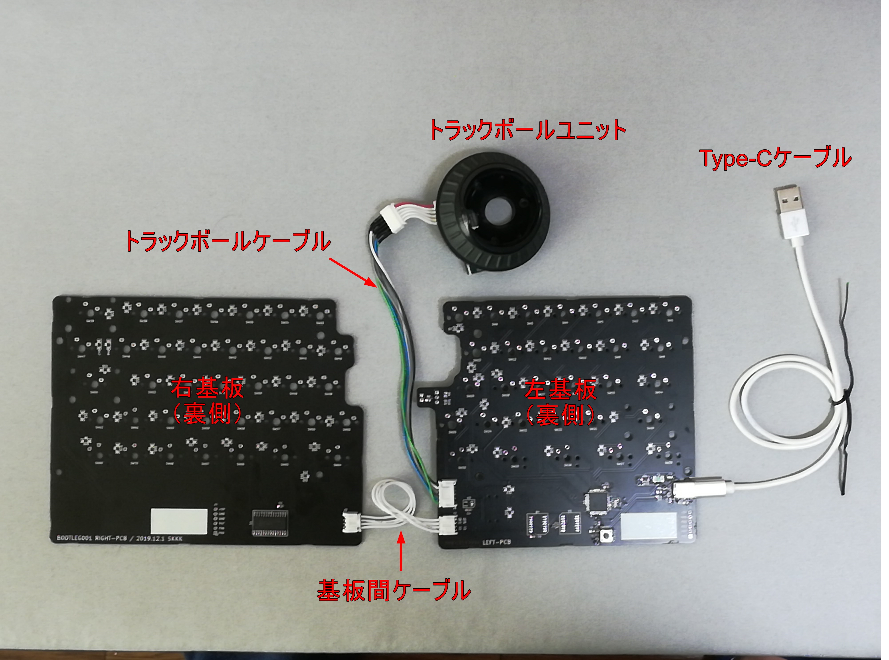

1. トラックボールケーブル(6ピン)を左基板に接続 熱収縮チューブが**入っていない方**を基板に接続してください。
1. トラックボールをトラックボールケーブル(6ピン)に接続
1. 基板間ケーブル(4ピン)を左基板と右基板に接続 向きはどちらでもOKです。
1. トラックボールユニットにボールを入れる
1. Type-C ケーブルを左基板と PC に接続 
Type-C ケーブルは、ストレージなどのデバイスを接続してコンピューターから認識した実績のあるケーブルをご使用ください。 
充電のみに対応したケーブルでは動作しません。

マイコンにはファームウェアが書込まれているので、PC に接続すると HID キーボードとして認識します。

接続後は以下の動作をウェブブラウザ等で確認します。

- トラックボールを転がすとマウスポインタが移動すること
- マウスボタンのクリックが反応すること

※ 出荷前に全数検査しておりますが、もし問題があれば[yakshaver(twitter)](https://twitter.com/_gnrr) までDMください。

動作が確認できたら、一旦ケーブルを外しておきます。

## スペーサの取付け

左右の基板の裏面に 5mm スペーサーを取付けます。M2.6トラスネジをおもて面から差し込んで固定します。 
裏面とおもて面を間違えないようにご注意ください。

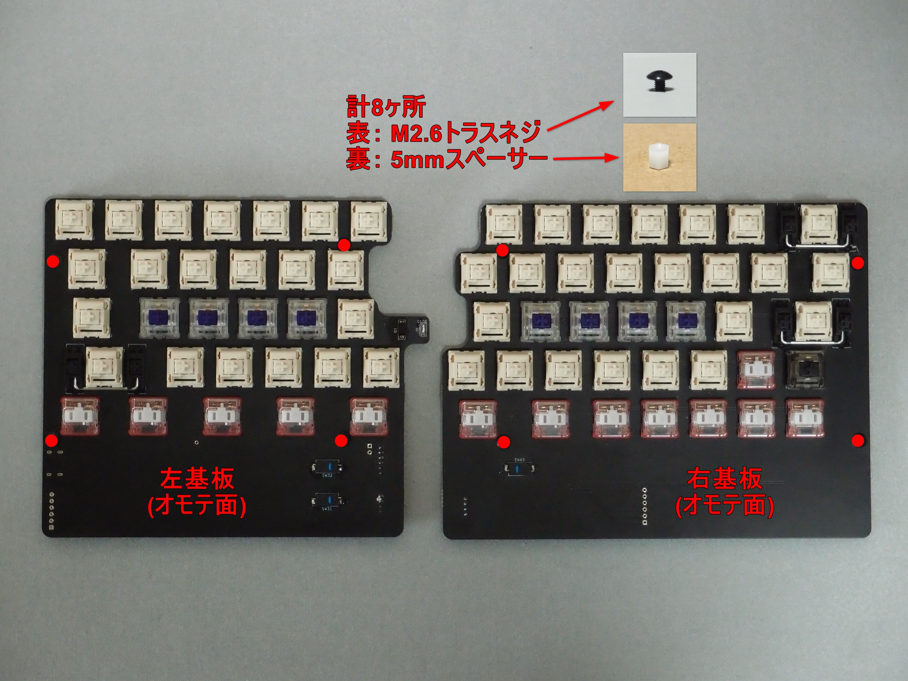

写真ではキースイッチがすでにハンダ付けされていますが、先にスペーサを取り付けておいたほうが作業しやすいです。

## キースイッチのハンダ付け

まず Choc スイッチをハンダ付けし、次にスタビライザーを取付け、最後に MX スイッチをハンダ付けすると楽にできると思います。

キースイッチ挿入後に真横からスイッチの差込み具合を確認し、スイッチが浮いていないかを確認してからハンダ付けすることをおすすめします。

左基板の端にはスクロールセンサーがあります。ハンダ付け作業中にセンサーの足を曲げてしまわないようご注意ください。 

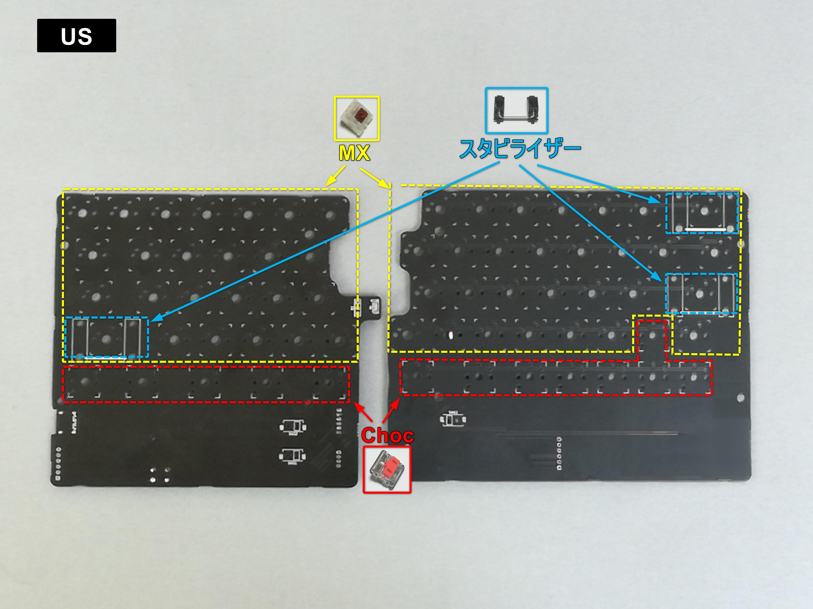

## ゴム足の取付け

ゴム足をケースに貼り付けます。

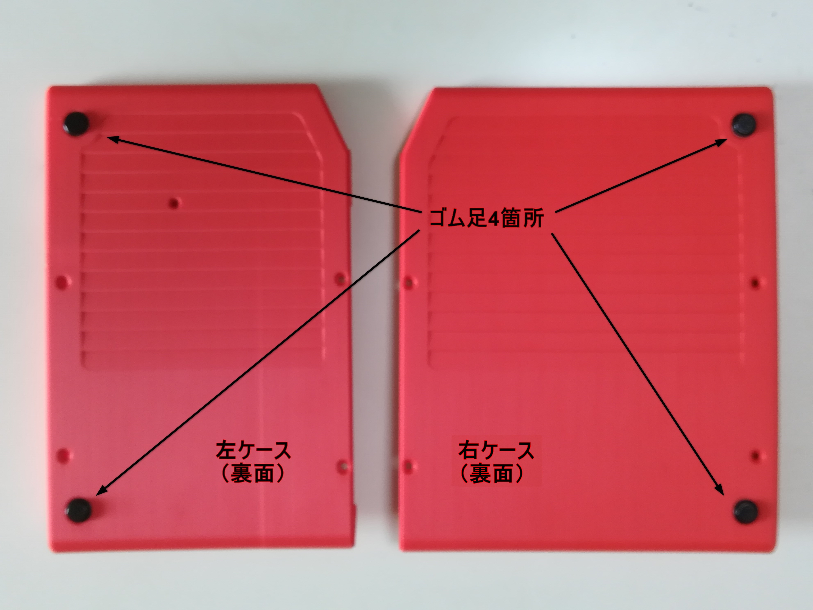

## 基板の取付け

左右ケースにそれぞれ基板を差込み、ねじで固定します。

下の写真の丸印の隙間に差し込むように、ケースの横から基板を入れます。

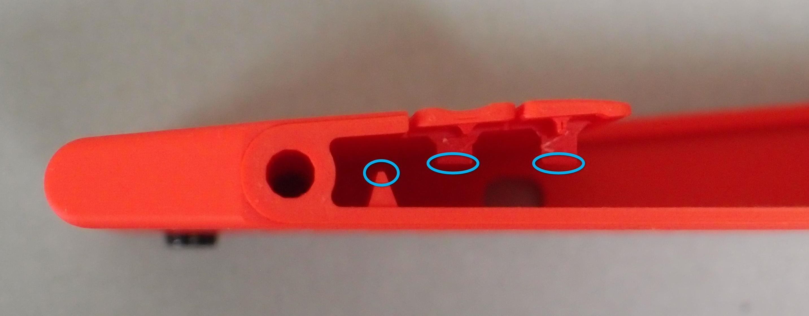

下図のように入ればOKです。

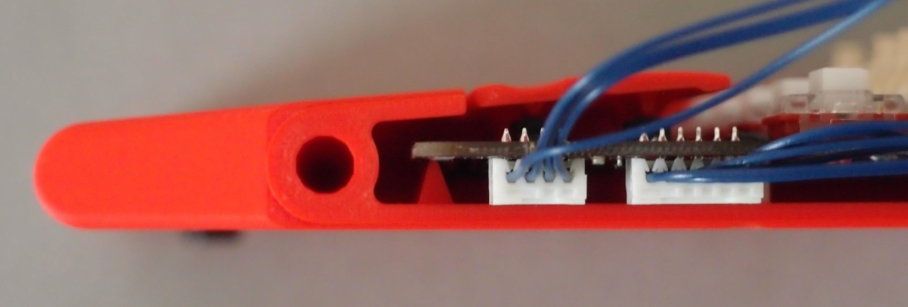

ケースの裏面からM2.6皿ねじ(下図)で4ヶ所を留めます。

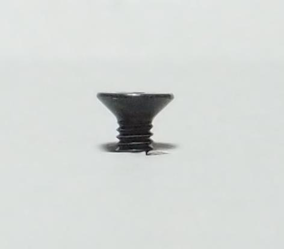

スペーサーを締めすぎないようご注意ください。

写真は左基板の取付け例ですが、右基板も同様に行います。

## 左基板へのケーブル取付け

トラックボールケーブル(6ピン)と基板間ケーブル(4ピン)を左基板に接続します。

各コネクタの接続は[動作確認](#動作確認)のときと同じですが、トラックボールユニットはまだ接続しません。

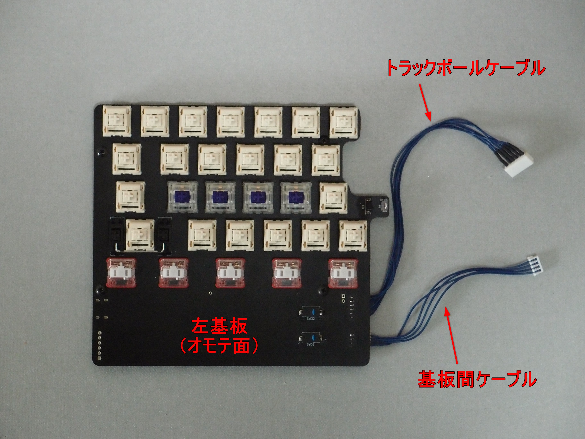

## パイプの差込み

下図のようにパイプを中央ケースに差込みます。

ケースの穴はパイプが入るのに十分な穴径にしていますが、組み立て後の仕上がりを重視するため、細い部分をいくつか設けています。そのため、ところどころキツく感じる部分があると思いますが、問題ありません。

2本のパイプは同じものなので、前後の区別はありません。

## 左ケースと中央ケースの組付け

左ケースの穴にパイプを通して中央ケースを寄せていきます。

下の写真と同じような位置まで寄せた後、ケーブルを中央ケースの内側に通していきます。

中央ケースには水色の部分に支柱があるので、それを避けるようにケーブルを矢印のように通します。トラックボールケーブルは、あらかじめ S字に曲げておくと通しやすいです。

ケース同士を接合したときに、基板の端にある**スクロールセンサーの基板下をトラックボールケーブルがくぐる**ようにします。トラックボールケーブルが基板の上を通るとキーキャップやスクロールリングに干渉してしまうので注意してください。

中央ケースにケーブルが通ったら、ケーブルがケースの間に挟まれないように徐々に寄せていき、最終的に下図のようにケーブルが通っていればOKです。

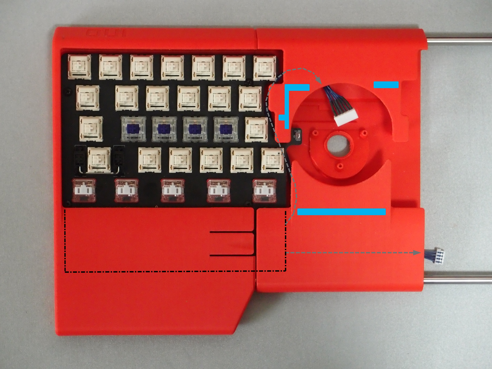

## 右ケースと中央ケースの組付け

同様に、右ケースの穴にパイプを通して中央ケースを寄せていきます。

こちらも、ケーブルがケースの間に挟まれないよう徐々に寄せていきます。基板間ケーブルが届く距離になったら、右基板に接続します。

このあとのボルト締めのために、ケース接合面を合わせておきます。

また、パイプの端面がザグリの面(ツラ)よりも突き出している場合は、押し込んでおきます。

## ボルト締め

前後左右の計4本の六角穴付きボルト(下図)をパイプの両端に締めこみます。

下記の手順で行ってください。

1. 左側の2本のボルトを指で締め込む。
1. 同様に右側も2本のボルトを指で締め込む。
1. 4本のボルトを指で締まる範囲で締め込んでいく。
1. 指で締まらなくなったら、2本のL字レンチの長い方を**後ろ側**の左右ボルトに差し込み、互いに逆方向にレンチを1回転させて締め込む。
1. 同様にL字レンチの長い方を**前側**の左右ボルトに差し込み、互いに逆方向にレンチを1回転させて締め込む。
1. 4 と 5 を繰り返し、前後が斜めにならないように注意しながら徐々に締め込んでいく。

ボルトを締めすぎるとケースを破損する可能性があるので、「ほどよく」締め付けてください。目安としては**L字レンチの短い方に指をかけて回した時、指が痛くならない程度**の締め具合としてください。

ソケットレンチやラチェットハンドル等を使わずに作業することをおすすめします。

この段階で下図のようになります。

## トラックボールユニットの接続

トラックボールケーブルをトラックボールユニットに接続します。

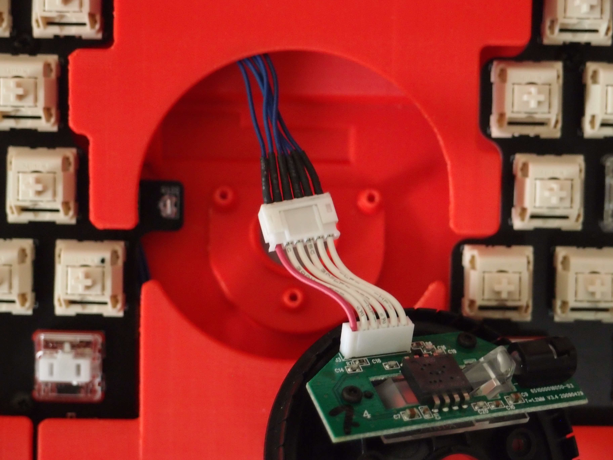

## トラックボールユニットの取付け

トラックボールユニットを取付ける際は、トラックボールユニットがスクロールセンサーに当たったり、手で触らないように注意しながら作業します。

スクロールセンサーの向きが変わるとスクロールしなくなるので、もし向きが変わってしまったら、垂直になるように指でゆっくりと直します。

トラックボールの取付けは下記の要領で行います。

1. トラックボールユニットを中央の丸い切り欠きに載せる。
1. トラックボールユニットの3つの小穴（下図の水色）を覗き込み、ケースの小穴と位置を合わせる。 
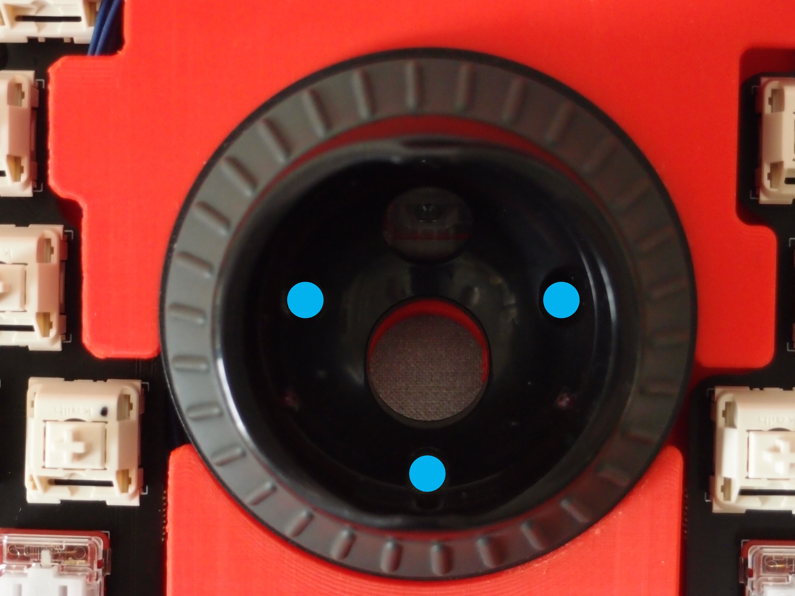

1. トラックボールユニットの後ろ側を押さえ、ケースの後ろ側の凹みにもぐり込ませる。 

1. トラックボールユニットの手前側を押さえ、ケースの前側の凹みに潜り込ませる。 
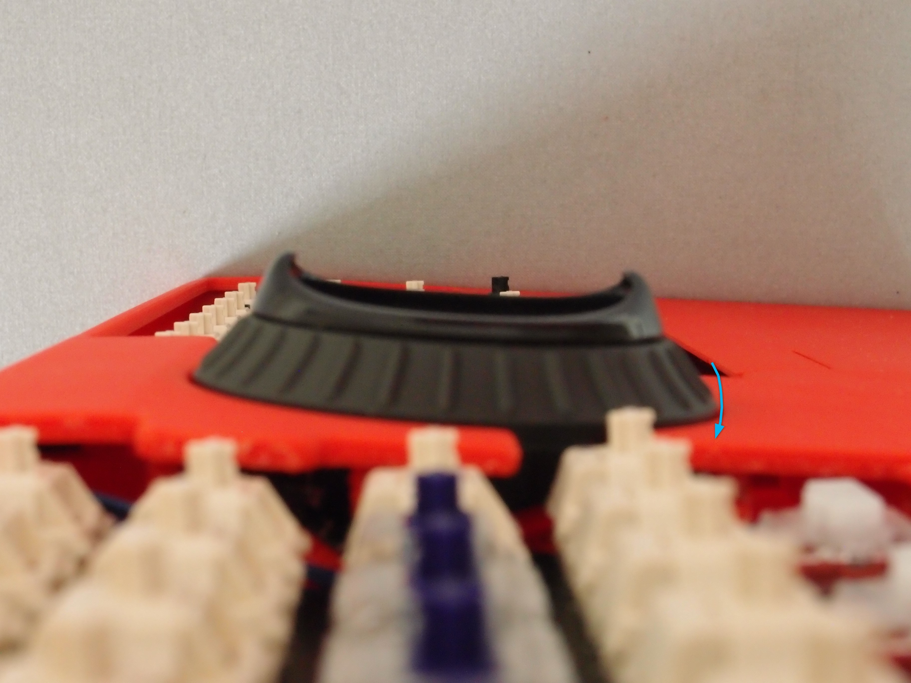

1. 穴位置を調整する。 トラックボールユニットの小穴がケースの小穴に合うようにトラックボールユニットをゆすって調整します。

1. タッピングねじ(下図) 3本をトラックボールユニットの小穴に入れる。 
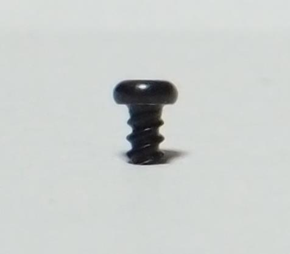

1. タッピングねじをヘクスローブドライバー (T6)で締める。 
タッピングねじなので、初めてねじ止めするときはドライバーの先端方向に少し押す感じで締め始めます。  
まず、3本ともゆるゆるの状態で締めておき、その後、それぞれ1/4回転ずつ回して締まり具合を確認しながら、3本が均等に締まるようにするとよいでしょう。  
強く締めすぎるとケースのネジ穴がバカになる恐れがあるので、若干弱めで締め付けを終わります。

最後に、スクロールリングを手で回して、ケースの端面やセンサーに当たらずスムーズに回ることを確認します。

## キーキャップの取付け

下図を参考に、キーキャップを取付けます。
MXキーキャップはお好みのものをお使いください。

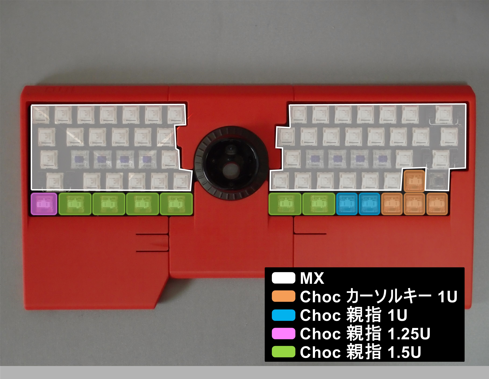

なお、キーキャップを取り外す際は、事前に[キーキャップの取り外し](#キーキャップの取り外し)を一読いただくことをおすすめします。

## ボールの取付け

ボールを入れると完成です。さっそく使ってみましょう。

## PCに接続

出荷状態でUSBケーブルをつなぐと、ino は Mac用のキーマップで起動します。

Windows / Linux など、ほかの環境につなぐときは下表のようにキーを押しながらUSBケーブルを接続します。

|接続先|レイヤ番号|同時押し
|------|----|---|
|Mac|0|`スペース` と `0` |
|Linux (Ubuntu)|1|`スペース` と `1`|
|Windows|2|`スペース` と `2`|

選択されたキーマップはマイコンの EEPROM に保存され、次回以降の起動時にも適用されます。

詳しくは[ino ファームウェアガイドのレイヤ構成](./firmware-guide.md#レイヤ構成)をご覧ください。

-----

お疲れさまでした。

一般的なキーボードと構造が違うため、戸惑われたところもあったかと思います。

わかりにくいところなどございましたら、[yakshaver(twitter)](https://twitter.com/_gnrr) までフィードバックをいただけると助かります。

なお、キーマップの変更やトラックボールの速度調整など、各種設定については[ファームウェアガイド](./firmware-guide.md) をご覧ください。

[長くお使いいただくために](#長くお使いいただくために) には、ケースをバラすときの注意点やお手入れなど、今後役立つことを書きました。ぜひ、ご一読いただければと思います。

-----

## 長くお使いいただくために

### キーキャップの取り外し

キーキャップを外すときは、誤ってキープーラーをキースイッチに引っかけないように注意してください。

このキーボードはトッププレートがないため、キープーラーを奥まで差し込むとスイッチに引っかかりやすくなります。誤ってスイッチを引っ張ってしまうとスイッチや基板を破損する恐れがあります。

また、Choc スイッチは一度分解するとトップハウジングのツメがゆるくなり、キーキャップを外すとトップハウジングごと外れてしまうことがあります。ルブ/スプリング交換したものを使う際はご注意ください。

### ケースをバラす時の注意

ケースを左右にバラす前に、まず最初に**トラックボールユニットを取り外す**ようにしてください。

トラックボールユニットを付けたまま、六角穴付きボルトを外してケースを左右に引っ張るとスクロールセンサーがスクロールリングに引っかかってセンサーの向きが変わってしまい、スクロールできなくなったり、センサーや基板を破損することがあります。

もしセンサーの向きが変わってしまったら、垂直になるように指でゆっくりと直します。

### スクロールリングのメンテナンス

材質の特性上、スクロールリングのゴムは経年変化や加水分解でベタついてきます。

ベタつきは無水エタノールやパーツクリーナーで除去できます。 パーツクリーナーを使用する場合は、プラスチックを侵さないものをお使いください。

### トラックボールのメンテナンス

トラックボールはマウスと違い、光学式でも以下のようなメンテナンスが必要です。

- ボールについた皮脂を柔らかい布で拭き取る
- トラックボールの支持球(人工ルビー)についたホコリを柔らかい布で拭き取る

ポイント精度と操球感を維持するため、定期的に行うことをおすすめします。

### ボールのカスタマイズ

あまり種類はありませんが、同じ直径 40mm のトラックボールであれば他のトラックボールからボールを移植できます。

|製品名|ボールの色|リンク|備考|
|---|---|---|---|
|Kensington Orbit with Scroll Ring K72337|青/ラメ|[Amazon](https://www.amazon.co.jp/dp/B004QE4JXA/)|同梱品|
|Kensington Orbit with Scroll Ring K72500|シルバー/ラメ|[Amazon](https://www.amazon.co.jp/dp/B084QQ2MB3/)|同梱品と色違いモデル|
|Kensington Orbit Optical KT-4327|シルバーグレイ/まだら|[Amazon](https://www.amazon.co.jp/dp/B01BXS17TA/)||
|Kensington Orbit Fusion K72362JP|赤/ラメ|[Amazon](https://www.amazon.co.jp/dp/B08JGDHXGJ/)||
|Logicool TrackMan Marble TM-150r|赤/黒ドット|[Amazon](https://www.amazon.co.jp/dp/B00CBOVSOA/)|若干こすれ感あり|
|A4Tech WWT-5E|赤?|[Google 画像検索](https://www.google.com/search?q=A4Tech+WWT-5E&tbm=isch)|終息品|
|~~Microsoft Trackball Explorer 2.0~~|~~赤?~~|[猫のトラックボールルーム](http://mineko.fc2web.com/box/tb-room/items/microsoft-trackball-explorer2f.html)|エイプリルフールネタでした|

他に40mmの球として 卓球のボール、オルゴールボール、水晶玉が見つかりました。

ただ、これらは直径40mmと記載があっても、実際はかなり誤差があるようです。

参考までに、下の写真はAmazonで購入した透明の人工水晶玉です。透明のものでもトラックボールとして機能しますが、重すぎて操球感は今ひとつでした。

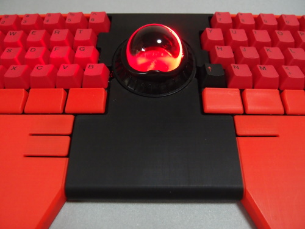

もし他に使えそうなものがありましたら、[yakshaver(twitter)](https://twitter.com/_gnrr) までお知らせいただければと思います。

----
## リンク
- [ino - トラックボールつき60%キーボード](./index.md)
- [ino ファームウェアガイド](./firmware-guide.md)
